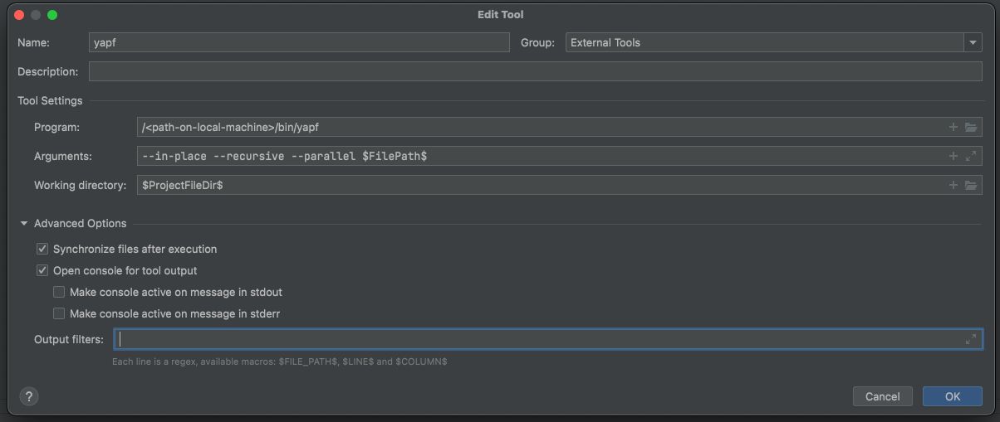

# External tools in PyCharm

## yapf (Yet Another Python Formatter)

Install a local instance of yapf on your machine, e.g in a virtual environment. Add an external tool in pycharm pointing to the
installed location. The tool can be configured like this (PyCharm 2021.2.2 PE):

